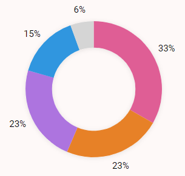
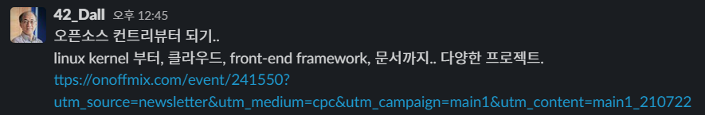
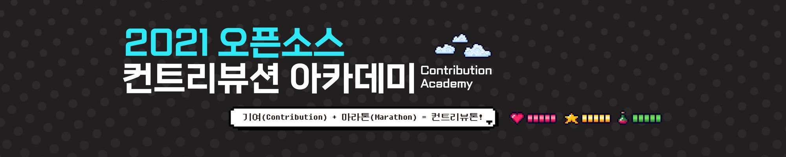
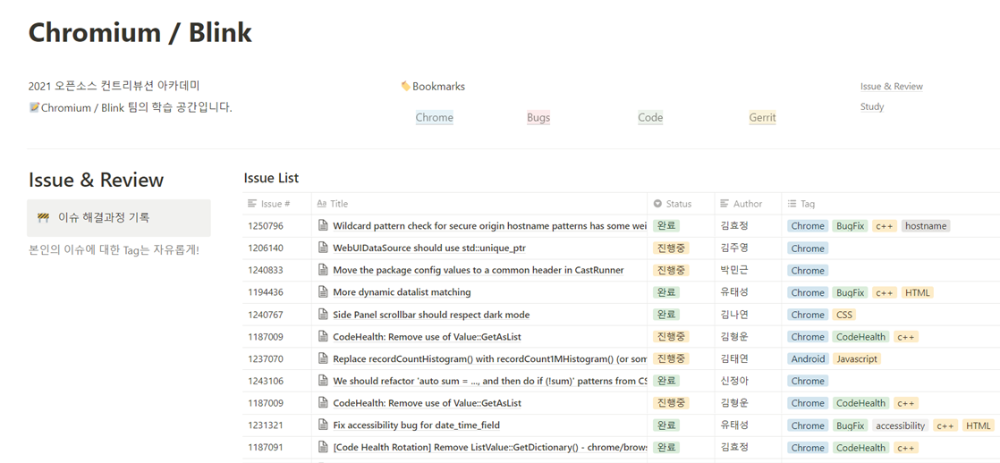
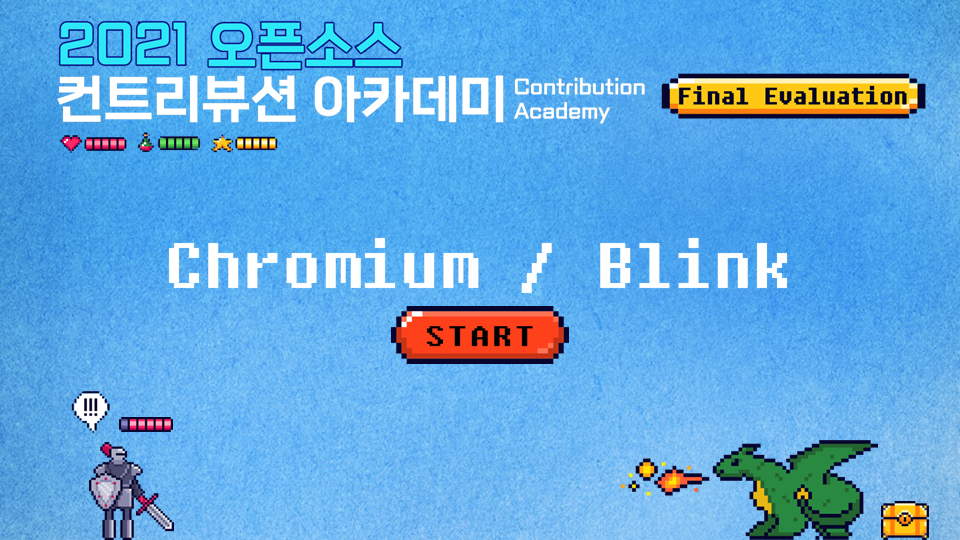

🤔 과연 나는 얼마나 발전하는 삶을 살았는가?

# ‘나’의 데이터

2021년의 시작은 퇴사 후 자유를 만끽하는 것부터 시작했다. 그러다 시간을 좀 더 효율적으로 쓰고 싶다는 생각이 들면서 생산성 어플이나 습관에 한 동안 집착 아닌 집착을 보였다. 그 때 알게 된 것이 Notion(노션)이었다. 처음 접하자마자 각종 활용 팁들을 이것저것 수집하고 따라해보면서 어떤식으로 이용할지 고민해봤다.

고민의 결론은 ‘나’에 대한 데이터를 모아서 보다 나은 ‘나’를 위해 사용해보자는 것이었다. 그 시점에 본 책과 daily report라는 학습법(?)에 꽂히기도 했기에 나의 시간을 기록해보기로 결심했다. 

겸사겸사 기록하는 습관도 길러보자는 생각으로 시간기록을 시작했다. 사용한 어플은 Toggl Track이다. 처음에는 구분을 어떻게 해야할 지 몰라서 카테고리 없이 무작정 기록했다. (밝은 회색)

어느정도 쌓인 뒤부터는 현재의 나(보라), 미래의 나(파랑), 관리(분홍), 낭비(주황)라는 4가지 카테고리로 나눠서 기록했다. 현재의 나를 위한 시간과 낭비되는 시간이 같다니.... 확실히 많이 놀았구나라는 생각이 든다. 이렇게 모아서 보니 진짜 반성하게 된다.

# 42Seoul

2021년 2월 15일 라피신이 시작되었다. 코로나로 인한 격일제 진행이었기 때문에 클러스터 근방에 방을 구하는 대신 김포에 사는 이모집에서 한 달간 신세지기로 했다. 이 한 달간 돌아오는 버스안에서 일기를 썼었다. 이 분야에 완전히 뛰어들겠다는 마음으로 시작했지만, 스스로에게 자신이 없었던 나에게 재밌고, 충분히 직업으로 삼을 수 있겠다는 희망을 보여준 시간이었다.

라피신이 끝나고 4기 2차 라피신이 진행되는 한 달동안은 그저 놀았다. 결과가 나올때까지 그냥 아무 생각 없이 쉬는 시간을 가졌다.

본과정생이 된 5월엔 자취를 위해 집을 알아보러 다녔다. 빠르게 이사까지 하고난 뒤부터는 거의 매일 클러스터에 가면서 서툴면서도 하나하나 과제를 해나갔다. 각종 기업설명회와 멘토특강도 꾸준히 들었다. 이런걸 자주 들어야 내가 어떤 분야에 관심이 생기는지 알 수 있을거라 생각했다. 코로나가 심각해지기 전인 6월까지는 진짜 노션 Diary가 꽤나 빽빽할 정도로 42서울에 적응하기 위한 집중의 시간이었다.

코로나로 인해 7월부터 9월 초까지는 전면 온라인 전환이되고, 블랙홀도 같이 멈추면서 약간 딴짓의 시간이 시작되었다. 오픈소스 컨트리뷰션 아카데미, 42Seoul 밋업데이, 피신 해커톤까지... 그래도 모든 것에 진심이었던 내게 좋은 결과로 돌아와서 참 다행이다.

11월 말부터는 다시 42Seoul 집중모드로 돌아왔다. 여기에 동아리와 스터디를 곁들인... 때로는 정신없기도 하지만 너무 재밌다. 그래서 한다.

# 오픈소스 컨트리뷰션 아카데미

딴짓의 시간이라고 칭했던 7월, 슬랙에서 오픈소스 컨트리뷰션 아카데미에 대한 글을 보자마자 하겠다고 결심하고 지원서를 썼다. 사실 프로젝트 설명을 볼 때마다 지금의 내가 할 수 있는게 하나도 없는거 아닌가 싶었지만, 그래도 꼭 해보고 싶어서 정말 열심히 어필했다. 운이 좋게도 1순위로 썼던 Chromium/Blink팀으로 참여할 수 있게 되었다. 

그리고 1순위로 썼던 Chromium/Blink팀에 참여하게 되었다! 이 전까지는 개발 경험이 있는 사람들 위주로 선정되었던 상당히 어려운 프로젝트였는데, 올해 멘토님은 chromium을 통해서 오픈소스 세계에 입문할 수 있도록 시작을 열어주고 싶어서 경험이 없는 사람들 위주로 선정했다고 하셨다. chromium은 전에 각종 브라우저들 이것저것 써보면서 들어봤었다. 네이버 웨일, 비발디 브라우저가 크로미움 기반 브라우저라는 정도? 사실 거의 아는게 없는 상태긴 했다; 그래도 내가 주로 사용하는 브라우저에 기반이 되는 오픈소스라는 것, 그게 구글에서 만든 프로젝트라 규모가 어마어마하다는 점이 나를 설레게했다. 

아무것도 몰랐기에 오픈소스 기여가 쉬울리가 없다. 환경설정부터, 어떤 이슈를 골라야하고 어떻게 수정하고 어떻게 리뷰받아야하는지..... 정말 모든 단계 하나하나가 나에게 거대한 장벽처럼 느껴졌다. 그럼에도 불구하고 자신의 시간을 쪼개어 멘티들을 서포트해주시는 멘토님, 본인이 공부한 내용을 공유해주는 팀원들에게 감동받으며 나도 열심히 참여했다. 오픈소스 기여 관련한 활동을 할 때마다 최대한 자세히 기록하려 노력했고, 팀원들과 슬랙 외에 같이 공유했으면 하는 내용들을 노션페이지를 만들어 함께 사용하고자 했다. 그래서일까, 어쩌다보니 리드멘티까지 되어서 최종발표까지 진행했다. 개인적으로 준비하는 시간에 다른 활동도 겹쳐서 지칠뻔했지만, 그래도 끝까지 살펴봐주고 응원해준 멘토님과 팀원들 덕분에 준비해온 대로 실수 없이 잘 마쳤다. 발표에 대한 결과까지 좋아서 더 행복했던 것은 안비밀😋

발표에서도 언급했던 내용처럼, 오픈소스 기여는 정말 내가 성장하고 있다는 사실이 체감될 정도로 많은 변화를 주었다. 시작할 때 진행한 Git 실습 교육부터 시작해서 다른 사람의 코드를 읽는 연습을 할 수 있었고, 가장 실감났던 때는 내가 어떤 이슈를 풀어나가는 과정에서 다른 이슈를 찾아냈던 점이었다. 그저 작성된 내용을 읽고 받아들이려고만 했던 시간을 거쳐, 사소하고 작은 부분일지라도 좀 더 개선할 수 있는 부분을 찾아서 제안했을 때 그 제안을 인정받았을 때의 그 기쁨은 첫 기여보다도 더 황홀했다. 이 시점을 계기로 아카데미 기간 이후로도 기여를 꾸준히 해야겠다는 다짐을 하게되었다. 

# 마무리

2021년은 그야말로 ‘도전’이자 ‘라피신(수영장)’의 해였다. 다시 해보자는 생각으로 결심한 진로를 위해 일단 뛰어들었다. 비록 진짜 수영장은 갈 수 없었지만 내가 한 해동안 뛰어든 다양한 수영장에는 수많은 사람들과 함께였다. 다 같이 헤엄치는 이 곳에서 때로는 게을렀고, 때로는 무리하기도 했지만  빠져들 수 있음에 행복하다. 미리 단정짓고 포기했던 그 때의 나에게 다시 말해주고 싶다. 나도 할 수 있다고.

2022년에도 열심히 헤엄칠거다. 머물고 싶은 섬이 보일 때까지, 정말 미친듯이 수영할 생각이다.