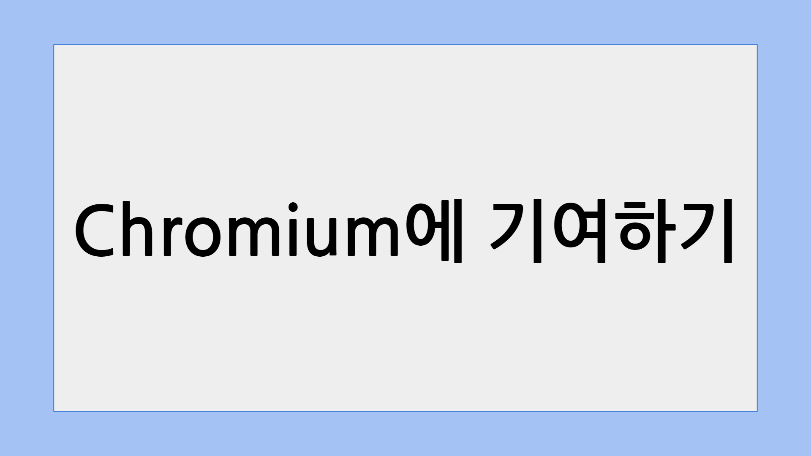
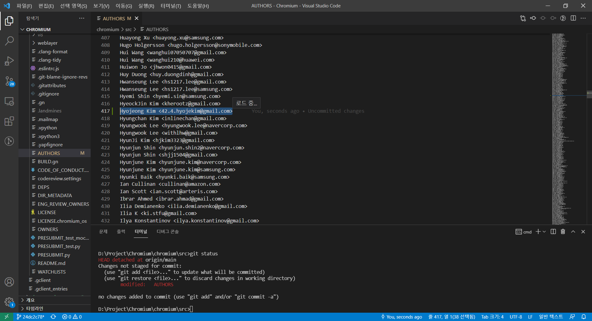
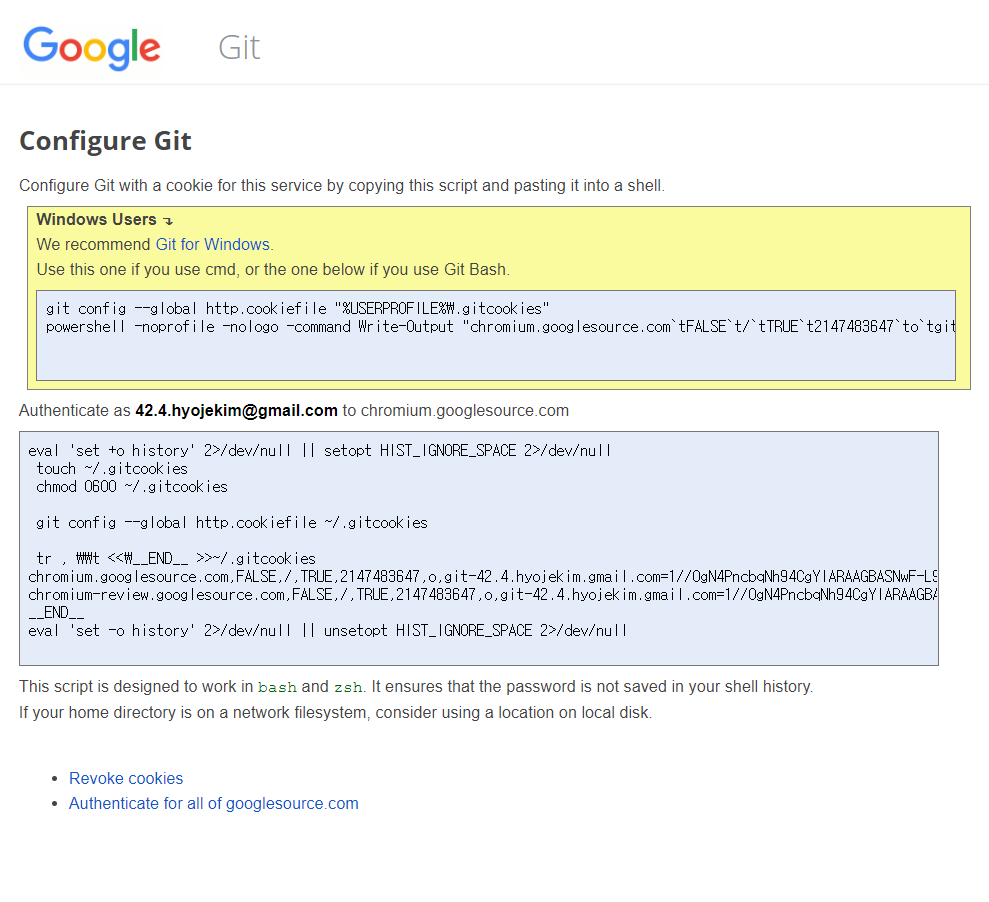
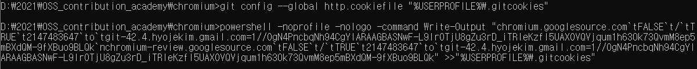
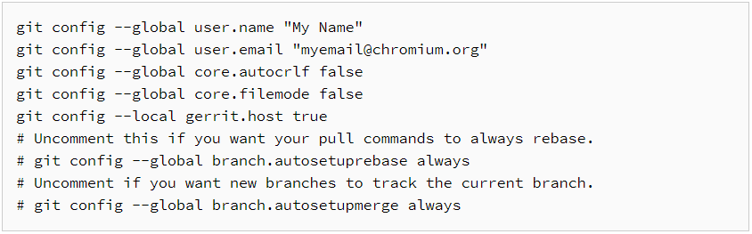
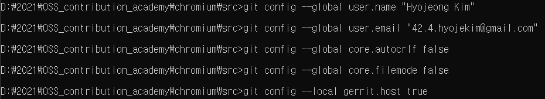
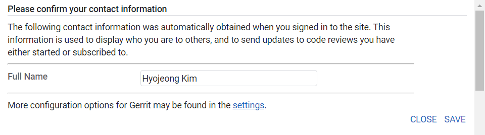
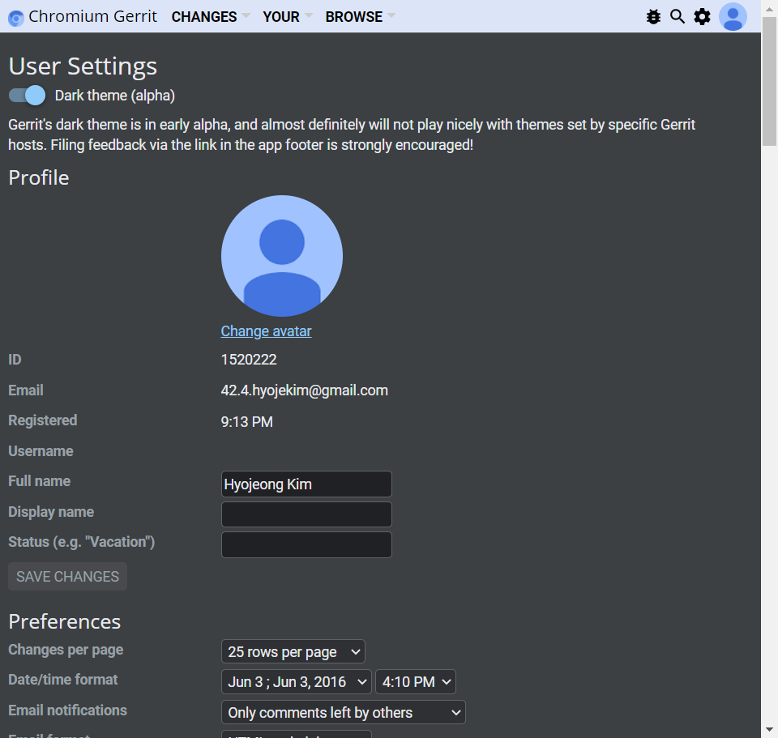

*본 글은 [Contributing to Chromium](https://chromium.googlesource.com/chromium/src/+/refs/heads/main/docs/contributing.md)과 [Commit Checklist](https://chromium.googlesource.com/chromium/src/+/refs/heads/main/docs/commit_checklist.md)의 일부를 번역하여 작성되었습니다.*

---

# 이제 뭘 하면 되는거지?

Chromium 빌드 환경을 구축한 뒤에는 해결하고자하는 Issue를 찾고, 수정해서 코드리뷰를 받는 본격적인 기여 작업을 시작하면 된다.

Chromium 관련 Issue는 아래 링크로 접속해 확인할 수 있다. 

[Monorail - chromium - An open-source project to help move the web forward. - Monorail](https://bugs.chromium.org/p/chromium/issues/list)

라벨이나 필터 기능을 이용해 골라서 검색할 수 있으며, GoodFirstBug 라벨은 입문자에게 추천하는 이슈들이라고 한다.

진행하고자 하는 Issue를 찾았다면, comment를 달아 다른 사람이 동시에 진행하는 일이 생기지 않도록 하자.

- Chromium에 기여하는게 완전 처음이라면?
    
    Contributing to Chromium에는 처음 기여할 때 거쳐야하는 절차가 안내되어있다. 
    
    ## Legal Stuff
    
    - 모든 기여자는 [CLA](https://cla.developers.google.com/clas) 서명을 진행해야한다.
    - 오픈소스 프로젝트의 저작권 법적 문제를 피하기 위한 장치이다.
    
    ### First-time contributors
    
    - 처음 기여하는 경우 Chromium이나 Chromium OS의 AUTHORS 파일에 이름과 연락처 정보를 추가한다.
    - 이 때 수정한 내용만 가지고 패치하지 말고 처음 패치할 때 추가해서 진행해야한다.
    
    
    알파벳순으로 정렬된 파일을 쭉 따라서 내 이름이 들어갈 위치에 추가로 작성하고 저장한다.
    
    알파벳순으로 정렬된 파일을 쭉 따라서 내 이름이 들어갈 위치에 추가로 작성하고 저장한다.
    
    ## Initial git setup
    
    - [https://chromium-review.googlesource.com/new-password](https://chromium-review.googlesource.com/new-password) 로 접속한다.
    - 하라는대로 cmd창에 복붙해준다.
    
    
    복사를 위해 파란색 상자를 한 번 클릭하면 한 번에 선택되므로 바로 ctrl+C, ctrl+V 진행하면 된다.
    
    복사를 위해 파란색 상자를 한 번 클릭하면 한 번에 선택되므로 바로 ctrl+C, ctrl+V 진행하면 된다.
    
    
    
    위에서 추천한대로 Git CMD를 이용해서 진행했다.
    
    - Git 기본 설정을 다시 확인한다.
    
    
    
    
    
    - [https://chromium-review.googlesource.com/settings/](https://chromium-review.googlesource.com/settings/) 접속해서 이메일이 맞게 설정되었는지 재확인한다.
    
    
    
    
    
    - 여기까지의 기본 세팅은 맨 처음 1회만 진행하면 된다.
    

# 본격적으로 코드를 수정해보자

기본 세팅까지도 완료되었으면 아래의 체크리스트를 따라가면서 이슈를 해결해보자.

1. Create a new branch or witch to the correct branch
    - `git checkout -b <branch_name> -t origin/main`
    - 작업을 시작하기 전 늘 새로운 branch를 생성해 진행한다.
    - 혹은 이미 만들어진 적절한 branch로 이동해서 작업하자.
    - +) 작업하고자하는 crbug 상태를 "started"로 전환해서 중복 작업을 피할 수 있도록 하자.
    - [http://dogfeet.github.io/articles/2012/git-tracking-vs-remote-tracking.html](http://dogfeet.github.io/articles/2012/git-tracking-vs-remote-tracking.html)
    - [https://git-scm.com/book/ko/v2/Git-브랜치-브랜치란-무엇인가](https://git-scm.com/book/ko/v2/Git-%EB%B8%8C%EB%9E%9C%EC%B9%98-%EB%B8%8C%EB%9E%9C%EC%B9%98%EB%9E%80-%EB%AC%B4%EC%97%87%EC%9D%B8%EA%B0%80)
    - upstream에 변경된 사항을 그와 연결된 downstream에 적용하려면 `git rebase -i` 명령어를 이용해 rebase 작업을 진행한다.
        
        ~~사실 이 부분이 어떤 경우를 뜻하는지 잘 모르겠다;~~
        
    
2. If there's a local upstream branch, rebase the upstream changes
    - rebase가 끝나면 `git rebase --continue` 를 실행한다.
    
3. Make your changes
4. Make sure the code builds correctly
    - 마음껏 수정한 뒤, 최소한의 공통 대상들에 대해 빌드가 정상적으로 이루어지는지 확인한다.
        - chrome
        - unit_tests
        - broweser_tests
    - 의도치않게 다른 빌드를 간섭하는 경우가 쉽게 발생할 수 있으므로 확인하고 넘어가자.
    
5. Test your changes
6. Write unit or browser tests for any new code
7. Ensure the code is formatted nicely
    - `git cl format --js` 을 실행해 기본적인 코딩 가이드를 맞춰준다.
        - `--js` 옵션은 JavaScript도 기본 format에 맞게 수정해준다.
    
8. Review your changes
    - `git diff` 나 `git upstream-diff` 를 이용해 이전 커밋들과의 변경사항을 다시 확인한다.
    - 여기서 `git upstream-diff`의 결과가 cl upload 했을 때 Gerrit에 업로드 되는 내용이다.
    
9. Stage relevant files for commit
    - `git add` 로 수정한 모든 파일들을 등록한다.
    
10. Commit your changes
    - commit message 작성법을 참고해서 커밋을 진행한다.
    
11. Squash your commits
    - 너무 많은 커밋들이 있는 상황에서 커밋별 충돌을 방지하기 위해서는 하나의 커밋으로 합쳐주는 것을 고려해볼만하다.
    - `git commit --amend` 명령어는 가장 최신 커밋에 현재 수정내역을 합치는 방식이다.
    - `git rebase -i` 명령어를 이용해 편집기 화면이 뜨면 pick 대신 squash를 작성해 하나의 커밋에 squash라고 쓰인 커밋들이 합쳐진다.
    - [https://git-scm.com/book/ko/v2/Git-도구-히스토리-단장하기](https://git-scm.com/book/ko/v2/Git-%EB%8F%84%EA%B5%AC-%ED%9E%88%EC%8A%A4%ED%86%A0%EB%A6%AC-%EB%8B%A8%EC%9E%A5%ED%95%98%EA%B8%B0)
    - [https://stackoverflow.com/questions/35044229/git-difference-between-amend-and-squash-commands](https://stackoverflow.com/questions/35044229/git-difference-between-amend-and-squash-commands)
    
12. Rebase your local repository
    - 변경사항을 동기화하고 merge시 발생하는 충돌 오류를 해결하는 절차이다.
    - `git rebase-update` 를 실행해 Chromium 소스파일들(origin/main)을 업데이트하고 rebase한다.
        - 이 때 충돌이 발생하면 수동으로 수정이 필요하다.
    - rebase 이후 빌드가 깨질 수도 있으므로 `gclient sync -D` 를 통해 종속성을 업데이트시켜준다
        - 하위 저장소들도 동기화하고 더이상 필요하지 않는 것을 삭제한다.
        - 필요에 따라 hooks를 다시 실행하기도 한다.
    
13. Upload the CL to Gerrit
    - `git cl upload` 를 실행시킨다.
        - `-b <bug_number>`를 이용하면 자동적으로 커밋메세지에 bug 참조가 생긴다. `-b None`도 사용할 수 있다.
        - `—edit-description`을 이용하면 커밋 메세지를 업데이트 할 수 있다.
            - 대괄호를 사용해서 hashtag를 추가할 수 있다.
        - `-r`옵션을 사용하면 리뷰어를 추가할 수 있다.
    - `git cl issue`를 통해 올바른 Gerrit의 change list에 업로드되는지 확인한다.
        - 새로운 change list라면 issue number는 따로 없고 업로드할 때 자동적으로 생성된다.
        - `git cl issue <issue_number>`를 이용하면 새 패치를 업로드하기 위해 기존 change list를 지정할 수 있다.
    - Patch title을 잘 작성해주자.
        
        
14. Check the CL again in Gerrit
    - `git cl web`을 통해 연결된 Gerrit URL로 접속하고 업로드된 파일들이 올바른지 확인하자.
    - 리뷰 요청 전에 자체적으로 검토하자.
    
15. Make sure all auto-regression tests pass
    - "CQ Dry Run"을 클릭해 모든 검토가 끝날때까지 기다린다.
    
16. Add reviewers to review your code
17. Start Your Review
18. Implement feedback from your reviewers
19. Land your CL
    - LGTM : Looks Good To Me
    
20. Cleanup
    - Change list가 반영되고 나면, git rebase-update나 git cl archive를 실행해 작업 branch를 정리한다.
    - crbug 상태를 "fixed"로 변경한다.